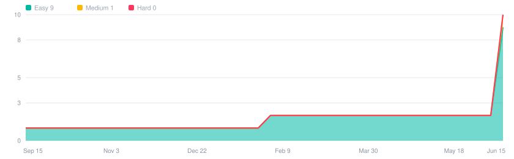
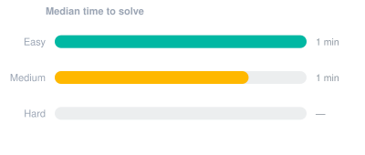
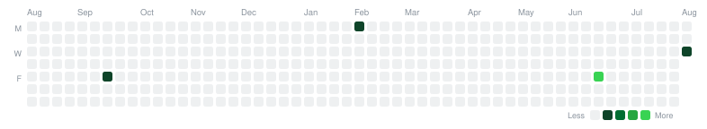
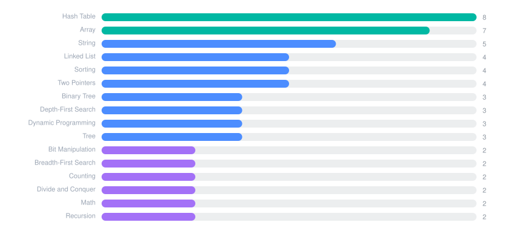

<h1 align="center">LeetCode Solutions</h1>

<p align="center">
  <i>An automatically maintained archive of my problem-solving practice —</i><br/>
  <i>every accepted submission, with the reasoning that got there.</i>
</p>

<p align="center">
  
  
  
  
</p>

<table align="center"><tr>
<td align="center" width="20%">
<b style="font-size:22px">56</b><br/>
<sub>Solved</sub>
</td>
<td align="center" width="20%">
<b style="font-size:22px">29/71</b><br/>
<sub>Topics</sub><br/><sub><i>41% coverage</i></sub>
</td>
<td align="center" width="20%">
<b style="font-size:22px">1d</b><br/>
<sub>Current streak</sub><br/><sub><i>best 1d</i></sub>
</td>
<td align="center" width="20%">
<b style="font-size:22px">24s</b><br/>
<sub>Median solve</sub><br/><sub><i>4 timed</i></sub>
</td>
<td align="center" width="20%">
<b style="font-size:22px">top 7%</b><br/>
<sub>Avg runtime</sub><br/><sub><i>2 in top 10%</i></sub>
</td>
</tr></table>

<p align="center"><a href="https://Rudrasamadhiya.github.io/leetcode/"><b>📊 Open the interactive dashboard →</b></a></p>

---

## 📈 Progress over time



<table><tr>
<td width="45%"></td>
<td></td>
</tr></table>

| Difficulty | Solved | Share | |
|:--|--:|--:|:--|
| Easy | **23** | 41.1% | `█████████░░░░░░░░░░░░░` |
| Medium | **33** | 58.9% | `█████████████░░░░░░░░░` |
| Hard | **0** | 0.0% | `░░░░░░░░░░░░░░░░░░░░░░` |

## 🔥 Activity



**1** day current streak · **1** day best streak · **4** active days · **1%** consistency

## 🎯 Topic coverage


Covered **29** of **71** tracked topics.



<details>
<summary><b>Topics not yet attempted</b></summary>

**Data Structures** — 10 remaining

`Queue` `Heap (Priority Queue)` `Graph` `Trie` `Union Find` `Segment Tree` `Binary Indexed Tree` `Monotonic Queue` `Ordered Set` `Doubly-Linked List`

**Algorithms** — 11 remaining

`Shortest Path` `Minimum Spanning Tree` `Strongly Connected Component` `Eulerian Circuit` `Quickselect` `Counting Sort` `Bucket Sort` `Radix Sort` `Merge Sort` `Rolling Hash` `Suffix Array`

**Math & Theory** — 9 remaining

`Bitmask` `Number Theory` `Combinatorics` `Geometry` `Probability and Statistics` `Randomized` `Game Theory` `Reservoir Sampling` `Rejection Sampling`

**Design & Other** — 12 remaining

`Design` `Simulation` `Enumeration` `Interactive` `Iterator` `Data Stream` `Concurrency` `Database` `Shell` `Line Sweep` `Brainteaser` `Bucket`

</details>

## ⚡ Performance

| Difficulty | Median | Average | Range |
|:--|--:|--:|:--|
| Easy | 43s | 43s | 18s – 1m 08s |
| Medium | 16s | 16s | 1s – 30s |
| Hard | — | — | — |

Runtime percentile averages **92.7** across 4 submissions, with **2** landing in the top 10%.

<details>
<summary><b>Fastest accepted solutions</b></summary>

| Problem | Runtime | Beats |
|:--|:--|--:|
| [Roman to Integer](./Easy/0013-roman-to-integer) | 2 ms | 100.0% |
| [Reverse Integer](./Medium/0007-reverse-integer) | 1 ms | 100.0% |

</details>

## 📝 Notes pending

**52** problems imported from history without a write-up. Re-solve one on LeetCode and the review card will capture the reasoning.

<details>
<summary>Show all 52</summary>

| Problem | Difficulty | Solved |
|:--|:--|:--|
| [Two Sum](./Easy/0001-two-sum) | Easy | 2025-09-19 |
| [Add Two Numbers](./Medium/0002-add-two-numbers) | Medium | 2026-06-19 |
| [Longest Substring Without Repeating Characters](./Medium/0003-longest-substring-without-repeating-characters) | Medium | 2026-06-19 |
| [Zigzag Conversion](./Medium/0006-zigzag-conversion) | Medium | 2026-08-05 |
| [Container With Most Water](./Medium/0011-container-with-most-water) | Medium | 2026-06-19 |
| [3Sum](./Medium/0015-3sum) | Medium | 2026-06-19 |
| [Valid Parentheses](./Easy/0020-valid-parentheses) | Easy | 2026-06-19 |
| [Merge Two Sorted Lists](./Easy/0021-merge-two-sorted-lists) | Easy | 2026-06-19 |
| [Find the Index of the First Occurrence in a String](./Easy/0028-find-the-index-of-the-first-occurrence-in-a-string) | Easy | 2026-02-02 |
| [Search in Rotated Sorted Array](./Medium/0033-search-in-rotated-sorted-array) | Medium | 2026-06-19 |
| [Combination Sum](./Medium/0039-combination-sum) | Medium | 2026-06-19 |
| [Permutations](./Medium/0046-permutations) | Medium | 2026-06-19 |
| [Rotate Image](./Medium/0048-rotate-image) | Medium | 2026-06-19 |
| [Group Anagrams](./Medium/0049-group-anagrams) | Medium | 2026-06-19 |
| [Maximum Subarray](./Medium/0053-maximum-subarray) | Medium | 2026-06-19 |
| [Merge Intervals](./Medium/0056-merge-intervals) | Medium | 2026-06-19 |
| [Climbing Stairs](./Easy/0070-climbing-stairs) | Easy | 2026-06-19 |
| [Set Matrix Zeroes](./Medium/0073-set-matrix-zeroes) | Medium | 2026-06-19 |
| [Subsets](./Medium/0078-subsets) | Medium | 2026-06-19 |
| [Validate Binary Search Tree](./Medium/0098-validate-binary-search-tree) | Medium | 2026-06-19 |
| [Binary Tree Level Order Traversal](./Medium/0102-binary-tree-level-order-traversal) | Medium | 2026-06-19 |
| [Maximum Depth of Binary Tree](./Easy/0104-maximum-depth-of-binary-tree) | Easy | 2026-06-19 |
| [Construct Binary Tree from Preorder and Inorder Traversal](./Medium/0105-construct-binary-tree-from-preorder-and-inorder-traversal) | Medium | 2026-06-19 |
| [Best Time to Buy and Sell Stock](./Easy/0121-best-time-to-buy-and-sell-stock) | Easy | 2026-06-19 |
| [Valid Palindrome](./Easy/0125-valid-palindrome) | Easy | 2026-06-19 |
| [Single Number](./Easy/0136-single-number) | Easy | 2026-06-19 |
| [Linked List Cycle](./Easy/0141-linked-list-cycle) | Easy | 2026-06-19 |
| [Maximum Product Subarray](./Medium/0152-maximum-product-subarray) | Medium | 2026-06-19 |
| [Find Minimum in Rotated Sorted Array](./Medium/0153-find-minimum-in-rotated-sorted-array) | Medium | 2026-06-19 |
| [Intersection of Two Linked Lists](./Easy/0160-intersection-of-two-linked-lists) | Easy | 2026-06-19 |
| [Majority Element](./Easy/0169-majority-element) | Easy | 2026-06-19 |
| [Number of Islands](./Medium/0200-number-of-islands) | Medium | 2026-06-19 |
| [Reverse Linked List](./Easy/0206-reverse-linked-list) | Easy | 2026-06-19 |
| [Course Schedule](./Medium/0207-course-schedule) | Medium | 2026-06-19 |
| [House Robber II](./Medium/0213-house-robber-ii) | Medium | 2026-06-19 |
| [Contains Duplicate](./Easy/0217-contains-duplicate) | Easy | 2026-06-19 |
| [Invert Binary Tree](./Easy/0226-invert-binary-tree) | Easy | 2026-06-19 |
| [Product of Array Except Self](./Medium/0238-product-of-array-except-self) | Medium | 2026-06-19 |
| [Valid Anagram](./Easy/0242-valid-anagram) | Easy | 2026-06-19 |
| [Missing Number](./Easy/0268-missing-number) | Easy | 2026-06-19 |
| [Find the Duplicate Number](./Medium/0287-find-the-duplicate-number) | Medium | 2026-06-19 |
| [Longest Increasing Subsequence](./Medium/0300-longest-increasing-subsequence) | Medium | 2026-06-19 |
| [Coin Change](./Medium/0322-coin-change) | Medium | 2026-06-19 |
| [Sum of Two Integers](./Medium/0371-sum-of-two-integers) | Medium | 2026-06-19 |
| [Ransom Note](./Easy/0383-ransom-note) | Easy | 2026-06-19 |
| [Pacific Atlantic Water Flow](./Medium/0417-pacific-atlantic-water-flow) | Medium | 2026-06-19 |
| [Non-overlapping Intervals](./Medium/0435-non-overlapping-intervals) | Medium | 2026-06-19 |
| [Diameter of Binary Tree](./Easy/0543-diameter-of-binary-tree) | Easy | 2026-06-19 |
| [Subtree of Another Tree](./Easy/0572-subtree-of-another-tree) | Easy | 2026-06-19 |
| [Palindromic Substrings](./Medium/0647-palindromic-substrings) | Medium | 2026-06-19 |
| [Binary Search](./Easy/0704-binary-search) | Easy | 2026-06-19 |
| [Daily Temperatures](./Medium/0739-daily-temperatures) | Medium | 2026-06-19 |

</details>

## 🗂️ All solutions

<details open>
<summary><b>Easy</b> · 23 problems</summary>

| # | Problem | Topics | Language | Time |
|:--|:--|:--|:--|--:|
| `1` | [Two Sum](./Easy/0001-two-sum) | Array, Hash Table | java | — |
| `9` | [Palindrome Number](./Easy/0009-palindrome-number) | Math | java | 1m 08s |
| `13` | [Roman to Integer](./Easy/0013-roman-to-integer) | Hash Table, Math, String | java | 18s |
| `20` | [Valid Parentheses](./Easy/0020-valid-parentheses) | String, Stack, Bracket Sequences | java | — |
| `21` | [Merge Two Sorted Lists](./Easy/0021-merge-two-sorted-lists) | Linked List, Recursion | java | — |
| `28` | [Find the Index of the First Occurrence in a String](./Easy/0028-find-the-index-of-the-first-occurrence-in-a-string) | Two Pointers, String, String Matching | java | — |
| `70` | [Climbing Stairs](./Easy/0070-climbing-stairs) | Math, Dynamic Programming, Memoization | java | — |
| `104` | [Maximum Depth of Binary Tree](./Easy/0104-maximum-depth-of-binary-tree) | Tree, Depth-First Search, Breadth-First Search | java | — |
| `121` | [Best Time to Buy and Sell Stock](./Easy/0121-best-time-to-buy-and-sell-stock) | Array, Dynamic Programming | java | — |
| `125` | [Valid Palindrome](./Easy/0125-valid-palindrome) | Two Pointers, String | java | — |
| `136` | [Single Number](./Easy/0136-single-number) | Array, Bit Manipulation | java | — |
| `141` | [Linked List Cycle](./Easy/0141-linked-list-cycle) | Hash Table, Linked List, Two Pointers | java | — |
| `160` | [Intersection of Two Linked Lists](./Easy/0160-intersection-of-two-linked-lists) | Hash Table, Linked List, Two Pointers | java | — |
| `169` | [Majority Element](./Easy/0169-majority-element) | Array, Hash Table, Divide and Conquer | java | — |
| `206` | [Reverse Linked List](./Easy/0206-reverse-linked-list) | Linked List, Recursion | java | — |
| `217` | [Contains Duplicate](./Easy/0217-contains-duplicate) | Array, Hash Table, Sorting | java | — |
| `226` | [Invert Binary Tree](./Easy/0226-invert-binary-tree) | Tree, Depth-First Search, Breadth-First Search | java | — |
| `242` | [Valid Anagram](./Easy/0242-valid-anagram) | Hash Table, String, Sorting | java | — |
| `268` | [Missing Number](./Easy/0268-missing-number) | Array, Hash Table, Math | java | — |
| `383` | [Ransom Note](./Easy/0383-ransom-note) | Hash Table, String, Counting | java | — |
| `543` | [Diameter of Binary Tree](./Easy/0543-diameter-of-binary-tree) | Tree, Depth-First Search, Binary Tree | java | — |
| `572` | [Subtree of Another Tree](./Easy/0572-subtree-of-another-tree) | Tree, Depth-First Search, String Matching | java | — |
| `704` | [Binary Search](./Easy/0704-binary-search) | Array, Binary Search | java | — |

</details>

<details open>
<summary><b>Medium</b> · 33 problems</summary>

| # | Problem | Topics | Language | Time |
|:--|:--|:--|:--|--:|
| `2` | [Add Two Numbers](./Medium/0002-add-two-numbers) | Linked List, Math, Recursion | java | — |
| `3` | [Longest Substring Without Repeating Characters](./Medium/0003-longest-substring-without-repeating-characters) | Hash Table, String, Sliding Window | java | — |
| `5` | [Longest Palindromic Substring](./Medium/0005-longest-palindromic-substring) | Two Pointers, String, Dynamic Programming | java | 1s |
| `6` | [Zigzag Conversion](./Medium/0006-zigzag-conversion) | String | java | — |
| `7` | [Reverse Integer](./Medium/0007-reverse-integer) | Math | java | 30s |
| `11` | [Container With Most Water](./Medium/0011-container-with-most-water) | Array, Two Pointers, Greedy | java | — |
| `15` | [3Sum](./Medium/0015-3sum) | Array, Two Pointers, Sorting | java | — |
| `33` | [Search in Rotated Sorted Array](./Medium/0033-search-in-rotated-sorted-array) | Array, Binary Search | java | — |
| `39` | [Combination Sum](./Medium/0039-combination-sum) | Array, Backtracking | java | — |
| `46` | [Permutations](./Medium/0046-permutations) | Array, Backtracking | java | — |
| `48` | [Rotate Image](./Medium/0048-rotate-image) | Array, Math, Matrix | java | — |
| `49` | [Group Anagrams](./Medium/0049-group-anagrams) | Array, Hash Table, String | java | — |
| `53` | [Maximum Subarray](./Medium/0053-maximum-subarray) | Array, Divide and Conquer, Dynamic Programming | java | — |
| `56` | [Merge Intervals](./Medium/0056-merge-intervals) | Array, Sorting, Quicksort | java | — |
| `73` | [Set Matrix Zeroes](./Medium/0073-set-matrix-zeroes) | Array, Hash Table, Matrix | java | — |
| `78` | [Subsets](./Medium/0078-subsets) | Array, Backtracking, Bit Manipulation | java | — |
| `98` | [Validate Binary Search Tree](./Medium/0098-validate-binary-search-tree) | Tree, Depth-First Search, Binary Search Tree | java | — |
| `102` | [Binary Tree Level Order Traversal](./Medium/0102-binary-tree-level-order-traversal) | Tree, Breadth-First Search, Binary Tree | java | — |
| `105` | [Construct Binary Tree from Preorder and Inorder Traversal](./Medium/0105-construct-binary-tree-from-preorder-and-inorder-traversal) | Array, Hash Table, Divide and Conquer | java | — |
| `152` | [Maximum Product Subarray](./Medium/0152-maximum-product-subarray) | Array, Dynamic Programming | java | — |
| `153` | [Find Minimum in Rotated Sorted Array](./Medium/0153-find-minimum-in-rotated-sorted-array) | Array, Binary Search | java | — |
| `200` | [Number of Islands](./Medium/0200-number-of-islands) | Array, Depth-First Search, Breadth-First Search | java | — |
| `207` | [Course Schedule](./Medium/0207-course-schedule) | Depth-First Search, Breadth-First Search, Graph Theory | java | — |
| `213` | [House Robber II](./Medium/0213-house-robber-ii) | Array, Dynamic Programming | java | — |
| `238` | [Product of Array Except Self](./Medium/0238-product-of-array-except-self) | Array, Prefix Sum | java | — |
| `287` | [Find the Duplicate Number](./Medium/0287-find-the-duplicate-number) | Array, Two Pointers, Binary Search | java | — |
| `300` | [Longest Increasing Subsequence](./Medium/0300-longest-increasing-subsequence) | Array, Binary Search, Dynamic Programming | java | — |
| `322` | [Coin Change](./Medium/0322-coin-change) | Array, Dynamic Programming, Breadth-First Search | java | — |
| `371` | [Sum of Two Integers](./Medium/0371-sum-of-two-integers) | Math, Bit Manipulation | java | — |
| `417` | [Pacific Atlantic Water Flow](./Medium/0417-pacific-atlantic-water-flow) | Array, Depth-First Search, Breadth-First Search | java | — |
| `435` | [Non-overlapping Intervals](./Medium/0435-non-overlapping-intervals) | Array, Dynamic Programming, Greedy | java | — |
| `647` | [Palindromic Substrings](./Medium/0647-palindromic-substrings) | Two Pointers, String, Dynamic Programming | java | — |
| `739` | [Daily Temperatures](./Medium/0739-daily-temperatures) | Array, Stack, Monotonic Stack | java | — |

</details>

<details>
<summary><b>Browse by topic</b></summary>

<b>Array</b> (30)

- [1. Two Sum](./Easy/0001-two-sum) — Easy
- [11. Container With Most Water](./Medium/0011-container-with-most-water) — Medium
- [15. 3Sum](./Medium/0015-3sum) — Medium
- [33. Search in Rotated Sorted Array](./Medium/0033-search-in-rotated-sorted-array) — Medium
- [39. Combination Sum](./Medium/0039-combination-sum) — Medium
- [46. Permutations](./Medium/0046-permutations) — Medium
- [48. Rotate Image](./Medium/0048-rotate-image) — Medium
- [49. Group Anagrams](./Medium/0049-group-anagrams) — Medium
- [53. Maximum Subarray](./Medium/0053-maximum-subarray) — Medium
- [56. Merge Intervals](./Medium/0056-merge-intervals) — Medium
- [73. Set Matrix Zeroes](./Medium/0073-set-matrix-zeroes) — Medium
- [78. Subsets](./Medium/0078-subsets) — Medium
- [105. Construct Binary Tree from Preorder and Inorder Traversal](./Medium/0105-construct-binary-tree-from-preorder-and-inorder-traversal) — Medium
- [121. Best Time to Buy and Sell Stock](./Easy/0121-best-time-to-buy-and-sell-stock) — Easy
- [136. Single Number](./Easy/0136-single-number) — Easy
- [152. Maximum Product Subarray](./Medium/0152-maximum-product-subarray) — Medium
- [153. Find Minimum in Rotated Sorted Array](./Medium/0153-find-minimum-in-rotated-sorted-array) — Medium
- [169. Majority Element](./Easy/0169-majority-element) — Easy
- [200. Number of Islands](./Medium/0200-number-of-islands) — Medium
- [213. House Robber II](./Medium/0213-house-robber-ii) — Medium
- [217. Contains Duplicate](./Easy/0217-contains-duplicate) — Easy
- [238. Product of Array Except Self](./Medium/0238-product-of-array-except-self) — Medium
- [268. Missing Number](./Easy/0268-missing-number) — Easy
- [287. Find the Duplicate Number](./Medium/0287-find-the-duplicate-number) — Medium
- [300. Longest Increasing Subsequence](./Medium/0300-longest-increasing-subsequence) — Medium
- [322. Coin Change](./Medium/0322-coin-change) — Medium
- [417. Pacific Atlantic Water Flow](./Medium/0417-pacific-atlantic-water-flow) — Medium
- [435. Non-overlapping Intervals](./Medium/0435-non-overlapping-intervals) — Medium
- [704. Binary Search](./Easy/0704-binary-search) — Easy
- [739. Daily Temperatures](./Medium/0739-daily-temperatures) — Medium

<b>Backtracking</b> (3)

- [39. Combination Sum](./Medium/0039-combination-sum) — Medium
- [46. Permutations](./Medium/0046-permutations) — Medium
- [78. Subsets](./Medium/0078-subsets) — Medium

<b>Binary Search</b> (6)

- [33. Search in Rotated Sorted Array](./Medium/0033-search-in-rotated-sorted-array) — Medium
- [153. Find Minimum in Rotated Sorted Array](./Medium/0153-find-minimum-in-rotated-sorted-array) — Medium
- [268. Missing Number](./Easy/0268-missing-number) — Easy
- [287. Find the Duplicate Number](./Medium/0287-find-the-duplicate-number) — Medium
- [300. Longest Increasing Subsequence](./Medium/0300-longest-increasing-subsequence) — Medium
- [704. Binary Search](./Easy/0704-binary-search) — Easy

<b>Binary Search Tree</b> (1)

- [98. Validate Binary Search Tree](./Medium/0098-validate-binary-search-tree) — Medium

<b>Binary Tree</b> (7)

- [98. Validate Binary Search Tree](./Medium/0098-validate-binary-search-tree) — Medium
- [102. Binary Tree Level Order Traversal](./Medium/0102-binary-tree-level-order-traversal) — Medium
- [104. Maximum Depth of Binary Tree](./Easy/0104-maximum-depth-of-binary-tree) — Easy
- [105. Construct Binary Tree from Preorder and Inorder Traversal](./Medium/0105-construct-binary-tree-from-preorder-and-inorder-traversal) — Medium
- [226. Invert Binary Tree](./Easy/0226-invert-binary-tree) — Easy
- [543. Diameter of Binary Tree](./Easy/0543-diameter-of-binary-tree) — Easy
- [572. Subtree of Another Tree](./Easy/0572-subtree-of-another-tree) — Easy

<b>Bit Manipulation</b> (5)

- [78. Subsets](./Medium/0078-subsets) — Medium
- [136. Single Number](./Easy/0136-single-number) — Easy
- [268. Missing Number](./Easy/0268-missing-number) — Easy
- [287. Find the Duplicate Number](./Medium/0287-find-the-duplicate-number) — Medium
- [371. Sum of Two Integers](./Medium/0371-sum-of-two-integers) — Medium

<b>Boyer–Moore Majority Vote Algorithm</b> (1)

- [169. Majority Element](./Easy/0169-majority-element) — Easy

<b>Boyer–Moore String-Search Algorithm</b> (1)

- [28. Find the Index of the First Occurrence in a String](./Easy/0028-find-the-index-of-the-first-occurrence-in-a-string) — Easy

<b>Bracket Sequences</b> (1)

- [20. Valid Parentheses](./Easy/0020-valid-parentheses) — Easy

<b>Breadth-First Search</b> (7)

- [102. Binary Tree Level Order Traversal](./Medium/0102-binary-tree-level-order-traversal) — Medium
- [104. Maximum Depth of Binary Tree](./Easy/0104-maximum-depth-of-binary-tree) — Easy
- [200. Number of Islands](./Medium/0200-number-of-islands) — Medium
- [207. Course Schedule](./Medium/0207-course-schedule) — Medium
- [226. Invert Binary Tree](./Easy/0226-invert-binary-tree) — Easy
- [322. Coin Change](./Medium/0322-coin-change) — Medium
- [417. Pacific Atlantic Water Flow](./Medium/0417-pacific-atlantic-water-flow) — Medium

<b>Complete Knapsack</b> (1)

- [322. Coin Change](./Medium/0322-coin-change) — Medium

<b>Counting</b> (2)

- [169. Majority Element](./Easy/0169-majority-element) — Easy
- [383. Ransom Note](./Easy/0383-ransom-note) — Easy

<b>Depth-First Search</b> (8)

- [98. Validate Binary Search Tree](./Medium/0098-validate-binary-search-tree) — Medium
- [104. Maximum Depth of Binary Tree](./Easy/0104-maximum-depth-of-binary-tree) — Easy
- [200. Number of Islands](./Medium/0200-number-of-islands) — Medium
- [207. Course Schedule](./Medium/0207-course-schedule) — Medium
- [226. Invert Binary Tree](./Easy/0226-invert-binary-tree) — Easy
- [417. Pacific Atlantic Water Flow](./Medium/0417-pacific-atlantic-water-flow) — Medium
- [543. Diameter of Binary Tree](./Easy/0543-diameter-of-binary-tree) — Easy
- [572. Subtree of Another Tree](./Easy/0572-subtree-of-another-tree) — Easy

<b>Directed Acyclic Graph</b> (1)

- [207. Course Schedule](./Medium/0207-course-schedule) — Medium

<b>Divide and Conquer</b> (3)

- [53. Maximum Subarray](./Medium/0053-maximum-subarray) — Medium
- [105. Construct Binary Tree from Preorder and Inorder Traversal](./Medium/0105-construct-binary-tree-from-preorder-and-inorder-traversal) — Medium
- [169. Majority Element](./Easy/0169-majority-element) — Easy

<b>DP on Trees</b> (1)

- [543. Diameter of Binary Tree](./Easy/0543-diameter-of-binary-tree) — Easy

<b>Dynamic Programming</b> (10)

- [5. Longest Palindromic Substring](./Medium/0005-longest-palindromic-substring) — Medium
- [53. Maximum Subarray](./Medium/0053-maximum-subarray) — Medium
- [70. Climbing Stairs](./Easy/0070-climbing-stairs) — Easy
- [121. Best Time to Buy and Sell Stock](./Easy/0121-best-time-to-buy-and-sell-stock) — Easy
- [152. Maximum Product Subarray](./Medium/0152-maximum-product-subarray) — Medium
- [213. House Robber II](./Medium/0213-house-robber-ii) — Medium
- [300. Longest Increasing Subsequence](./Medium/0300-longest-increasing-subsequence) — Medium
- [322. Coin Change](./Medium/0322-coin-change) — Medium
- [435. Non-overlapping Intervals](./Medium/0435-non-overlapping-intervals) — Medium
- [647. Palindromic Substrings](./Medium/0647-palindromic-substrings) — Medium

<b>Floyd's Cycle Finding Algorithm</b> (2)

- [141. Linked List Cycle](./Easy/0141-linked-list-cycle) — Easy
- [287. Find the Duplicate Number](./Medium/0287-find-the-duplicate-number) — Medium

<b>Graph Theory</b> (1)

- [207. Course Schedule](./Medium/0207-course-schedule) — Medium

<b>Greedy</b> (2)

- [11. Container With Most Water](./Medium/0011-container-with-most-water) — Medium
- [435. Non-overlapping Intervals](./Medium/0435-non-overlapping-intervals) — Medium

<b>Hash Function</b> (1)

- [572. Subtree of Another Tree](./Easy/0572-subtree-of-another-tree) — Easy

<b>Hash Table</b> (13)

- [1. Two Sum](./Easy/0001-two-sum) — Easy
- [3. Longest Substring Without Repeating Characters](./Medium/0003-longest-substring-without-repeating-characters) — Medium
- [13. Roman to Integer](./Easy/0013-roman-to-integer) — Easy
- [49. Group Anagrams](./Medium/0049-group-anagrams) — Medium
- [73. Set Matrix Zeroes](./Medium/0073-set-matrix-zeroes) — Medium
- [105. Construct Binary Tree from Preorder and Inorder Traversal](./Medium/0105-construct-binary-tree-from-preorder-and-inorder-traversal) — Medium
- [141. Linked List Cycle](./Easy/0141-linked-list-cycle) — Easy
- [160. Intersection of Two Linked Lists](./Easy/0160-intersection-of-two-linked-lists) — Easy
- [169. Majority Element](./Easy/0169-majority-element) — Easy
- [217. Contains Duplicate](./Easy/0217-contains-duplicate) — Easy
- [242. Valid Anagram](./Easy/0242-valid-anagram) — Easy
- [268. Missing Number](./Easy/0268-missing-number) — Easy
- [383. Ransom Note](./Easy/0383-ransom-note) — Easy

<b>Knapsack Problem</b> (1)

- [322. Coin Change](./Medium/0322-coin-change) — Medium

<b>Knuth–Morris–Pratt Algorithm</b> (1)

- [28. Find the Index of the First Occurrence in a String](./Easy/0028-find-the-index-of-the-first-occurrence-in-a-string) — Easy

<b>Linked List</b> (5)

- [2. Add Two Numbers](./Medium/0002-add-two-numbers) — Medium
- [21. Merge Two Sorted Lists](./Easy/0021-merge-two-sorted-lists) — Easy
- [141. Linked List Cycle](./Easy/0141-linked-list-cycle) — Easy
- [160. Intersection of Two Linked Lists](./Easy/0160-intersection-of-two-linked-lists) — Easy
- [206. Reverse Linked List](./Easy/0206-reverse-linked-list) — Easy

<b>Longest Increasing Subsequence</b> (1)

- [300. Longest Increasing Subsequence](./Medium/0300-longest-increasing-subsequence) — Medium

<b>Manacher</b> (1)

- [5. Longest Palindromic Substring](./Medium/0005-longest-palindromic-substring) — Medium

<b>Math</b> (8)

- [2. Add Two Numbers](./Medium/0002-add-two-numbers) — Medium
- [7. Reverse Integer](./Medium/0007-reverse-integer) — Medium
- [9. Palindrome Number](./Easy/0009-palindrome-number) — Easy
- [13. Roman to Integer](./Easy/0013-roman-to-integer) — Easy
- [48. Rotate Image](./Medium/0048-rotate-image) — Medium
- [70. Climbing Stairs](./Easy/0070-climbing-stairs) — Easy
- [268. Missing Number](./Easy/0268-missing-number) — Easy
- [371. Sum of Two Integers](./Medium/0371-sum-of-two-integers) — Medium

<b>Matrix</b> (4)

- [48. Rotate Image](./Medium/0048-rotate-image) — Medium
- [73. Set Matrix Zeroes](./Medium/0073-set-matrix-zeroes) — Medium
- [200. Number of Islands](./Medium/0200-number-of-islands) — Medium
- [417. Pacific Atlantic Water Flow](./Medium/0417-pacific-atlantic-water-flow) — Medium

<b>Memoization</b> (1)

- [70. Climbing Stairs](./Easy/0070-climbing-stairs) — Easy

<b>Monotonic Stack</b> (1)

- [739. Daily Temperatures](./Medium/0739-daily-temperatures) — Medium

<b>Pigeonhole Principle</b> (1)

- [287. Find the Duplicate Number](./Medium/0287-find-the-duplicate-number) — Medium

<b>Prefix Sum</b> (1)

- [238. Product of Array Except Self](./Medium/0238-product-of-array-except-self) — Medium

<b>Quicksort</b> (1)

- [56. Merge Intervals](./Medium/0056-merge-intervals) — Medium

<b>Recursion</b> (3)

- [2. Add Two Numbers](./Medium/0002-add-two-numbers) — Medium
- [21. Merge Two Sorted Lists](./Easy/0021-merge-two-sorted-lists) — Easy
- [206. Reverse Linked List](./Easy/0206-reverse-linked-list) — Easy

<b>Sliding Window</b> (1)

- [3. Longest Substring Without Repeating Characters](./Medium/0003-longest-substring-without-repeating-characters) — Medium

<b>Sorting</b> (8)

- [15. 3Sum](./Medium/0015-3sum) — Medium
- [49. Group Anagrams](./Medium/0049-group-anagrams) — Medium
- [56. Merge Intervals](./Medium/0056-merge-intervals) — Medium
- [169. Majority Element](./Easy/0169-majority-element) — Easy
- [217. Contains Duplicate](./Easy/0217-contains-duplicate) — Easy
- [242. Valid Anagram](./Easy/0242-valid-anagram) — Easy
- [268. Missing Number](./Easy/0268-missing-number) — Easy
- [435. Non-overlapping Intervals](./Medium/0435-non-overlapping-intervals) — Medium

<b>Stack</b> (2)

- [20. Valid Parentheses](./Easy/0020-valid-parentheses) — Easy
- [739. Daily Temperatures](./Medium/0739-daily-temperatures) — Medium

<b>String</b> (11)

- [3. Longest Substring Without Repeating Characters](./Medium/0003-longest-substring-without-repeating-characters) — Medium
- [5. Longest Palindromic Substring](./Medium/0005-longest-palindromic-substring) — Medium
- [6. Zigzag Conversion](./Medium/0006-zigzag-conversion) — Medium
- [13. Roman to Integer](./Easy/0013-roman-to-integer) — Easy
- [20. Valid Parentheses](./Easy/0020-valid-parentheses) — Easy
- [28. Find the Index of the First Occurrence in a String](./Easy/0028-find-the-index-of-the-first-occurrence-in-a-string) — Easy
- [49. Group Anagrams](./Medium/0049-group-anagrams) — Medium
- [125. Valid Palindrome](./Easy/0125-valid-palindrome) — Easy
- [242. Valid Anagram](./Easy/0242-valid-anagram) — Easy
- [383. Ransom Note](./Easy/0383-ransom-note) — Easy
- [647. Palindromic Substrings](./Medium/0647-palindromic-substrings) — Medium

<b>String Matching</b> (2)

- [28. Find the Index of the First Occurrence in a String](./Easy/0028-find-the-index-of-the-first-occurrence-in-a-string) — Easy
- [572. Subtree of Another Tree](./Easy/0572-subtree-of-another-tree) — Easy

<b>Topological Sort</b> (1)

- [207. Course Schedule](./Medium/0207-course-schedule) — Medium

<b>Tree</b> (7)

- [98. Validate Binary Search Tree](./Medium/0098-validate-binary-search-tree) — Medium
- [102. Binary Tree Level Order Traversal](./Medium/0102-binary-tree-level-order-traversal) — Medium
- [104. Maximum Depth of Binary Tree](./Easy/0104-maximum-depth-of-binary-tree) — Easy
- [105. Construct Binary Tree from Preorder and Inorder Traversal](./Medium/0105-construct-binary-tree-from-preorder-and-inorder-traversal) — Medium
- [226. Invert Binary Tree](./Easy/0226-invert-binary-tree) — Easy
- [543. Diameter of Binary Tree](./Easy/0543-diameter-of-binary-tree) — Easy
- [572. Subtree of Another Tree](./Easy/0572-subtree-of-another-tree) — Easy

<b>Two Pointers</b> (9)

- [5. Longest Palindromic Substring](./Medium/0005-longest-palindromic-substring) — Medium
- [11. Container With Most Water](./Medium/0011-container-with-most-water) — Medium
- [15. 3Sum](./Medium/0015-3sum) — Medium
- [28. Find the Index of the First Occurrence in a String](./Easy/0028-find-the-index-of-the-first-occurrence-in-a-string) — Easy
- [125. Valid Palindrome](./Easy/0125-valid-palindrome) — Easy
- [141. Linked List Cycle](./Easy/0141-linked-list-cycle) — Easy
- [160. Intersection of Two Linked Lists](./Easy/0160-intersection-of-two-linked-lists) — Easy
- [287. Find the Duplicate Number](./Medium/0287-find-the-duplicate-number) — Medium
- [647. Palindromic Substrings](./Medium/0647-palindromic-substrings) — Medium

<b>Union-Find</b> (1)

- [200. Number of Islands](./Medium/0200-number-of-islands) — Medium

<b>Z Algorithm</b> (1)

- [28. Find the Index of the First Occurrence in a String](./Easy/0028-find-the-index-of-the-first-occurrence-in-a-string) — Easy

</details>

## 📁 How this repo is organised

```text
.
├── Easy/  Medium/  Hard/
│   └── 0001-two-sum/
│       ├── README.md          intuition, approach, complexity, edge cases, takeaway
│       └── solution.py        the accepted submission
├── assets/charts/             generated SVG analytics
├── docs/index.html            interactive dashboard (GitHub Pages)
├── .leetsync/stats.json       machine-readable ledger
└── README.md                  this file — regenerated on every push
```

Every folder is created automatically the moment a submission is accepted. 
Nothing here is written by hand.

---

<p align="center"><sub>Last synced August 5, 2026 · <a href="https://github.com/Rudrasamadhiya/leetcode">Rudrasamadhiya/leetcode</a> · generated by <b>LeetSync</b></sub></p>
